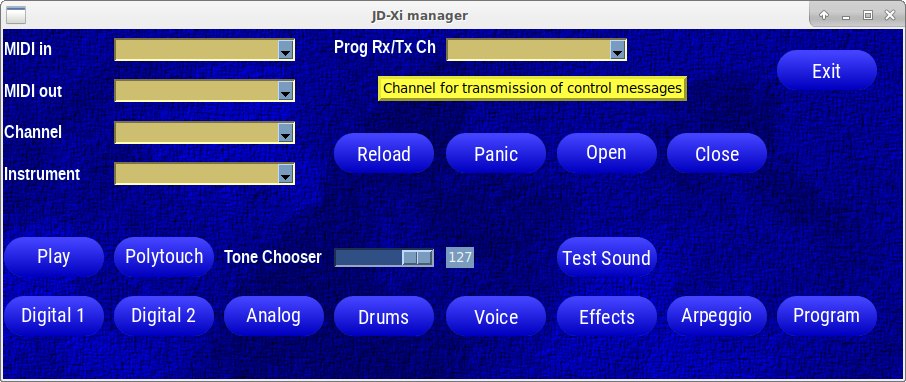
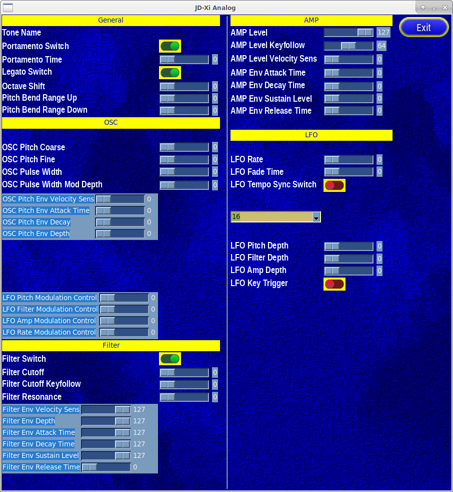

# JD-Xi-manager
Managing Roland JD-Xi Interactive Analog/Digital Crossover Synthesizer on the Linux machine.

After many years, I am trying to pull more beautiful sounds from this small, but powerfull machine. I'll do it through USB MIDI interface.
Pakages into consideration are:

I'll use tkinter, standard python interface to Tcl/Tk GUI toolkit:
- GUI - https://docs.python.org/3/library/tkinter.html

Idea is to use spreadsheet with defined widgets (labels, sliders, combo boxes, buttons, radio buttons, frames...) for each individual attribute or function, with positions for grid geometry manager inside tkinter,
export data to JSON and programmatically create a layout (with all necessary classes) for all components. That is done using utility.

Still using:
-  mido - https://mido.readthedocs.io/en/stable/

Latest SysEx ID table taken 9.10.2023. from  https://www.midi.org and converted to JSON file [ManufacturerSysExIDs.json](ManufacturerSysExIDs.json).

Memory map is from Roland's Parameter Address Map found in JD-Xi_MIDI_Imple_e01_W.pdf file. Here is extract of that chapter: [address_map.txt](address_map.txt) containing all mentioned maps in Roland's document.

Here area samples of 
Main

  

Analog Synth

 

and Digital Synth in progress

 
windows.
